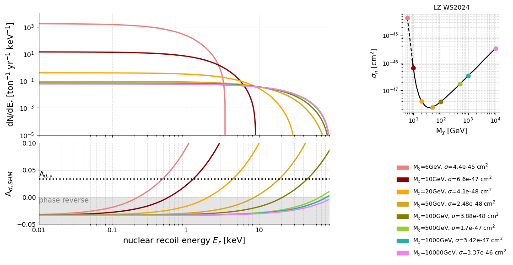

Result



computing elastic WIMP–nucleus nuclear recoil spectra.

```bash
python compute_el_spectrum.py
```
target Xenon, sigma_0 * halo

Outputs one file per WIMP mass to `WIMP_N_el_spectra/`, e.g. `WIMP-Nel_50GeV-Xe_1e-45cm2_pdf.txt`.


scale sigma_0 to current LZ exclusion limits
Standard halo model Ad, different masses
```python
from get_upperlimit_spectrum import load_exclusion_curve, get_exclusion_xsec

masses, xsecs, interp = load_exclusion_curve("WIMP_xsec_LZ_excludedtupperlimit.txt")
sigma_excl = get_exclusion_xsec(50 * u.GeV, interp)
Er, dN_dEr = get_WIMP_pdf(50 * u.GeV, sigma_excl, target="Xe")
```
